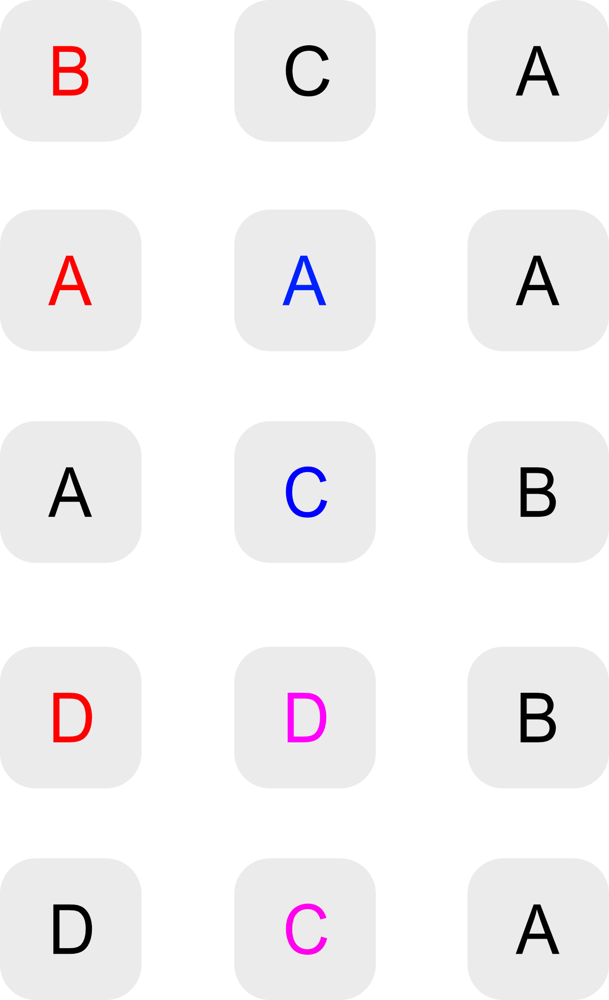
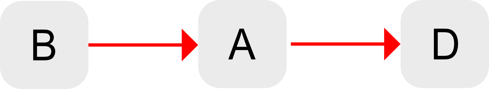
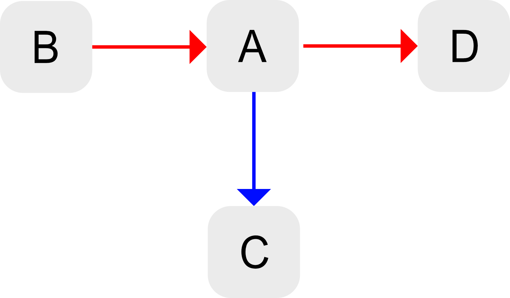
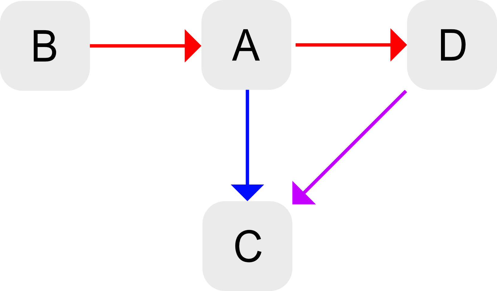
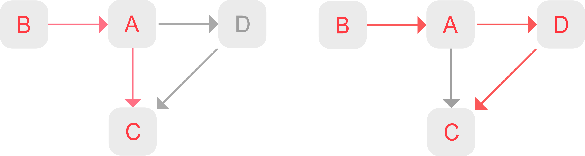
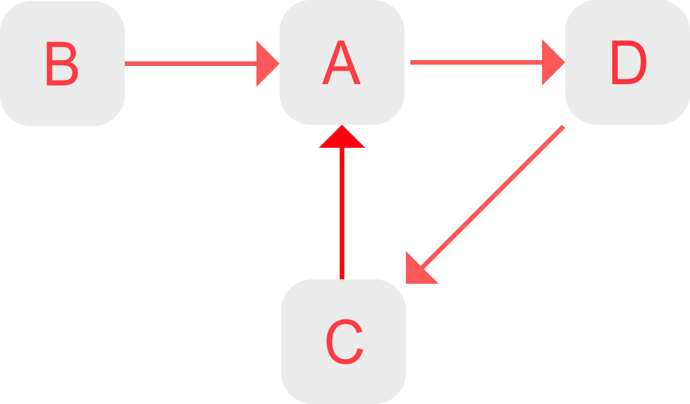

# [Alphabet Extractor](https://github.com/tuantle/alphabet-extractor)

Extract alphabet order of a given sorted word list. Take home coding challenge solution implemented in ***Javascript (ES6)***.

* * *

### Problem Overview

You are given a list of words that are sorted in alphabetical order. The only issue is that this alphabet isn’t English.
Can you determine the ordering of the alphabet?

*Note: you can assume the list of words will have enough information to derive the complete order of the alphabet.*

*Input*:

`[ 'bca', 'aaa', 'acb', 'ddb', 'dca' ]`

*Output*:

`[ 'b', 'a', 'd', 'c' ]`

* * *

### Solution & Explanation

**1** - From the given word list, extract the character ordered set information. Assuming the word list is sorted from the leftmost characters.

<p align="center">
    
</p>

Using the example word list `[ 'bca', 'aaa', 'acb', 'ddb', 'dca' ]`, the extracted character ordered set would be `[ 'b', 'a', 'd']`, `[ 'a', 'c' ]`, and `[ 'd', 'c' ]`. See the diagram above.

Below is the implementation of `getOrderedCharSet` function in javascript that extracts character ordered set information recursively.

```javascript
/**
 * @description - Extract character ordered set from a given listed of sorted words.
 *
 * using example: [ 'bca', 'aaa', 'acb', 'ddb', 'dca' ], in the first recursive pass,
 * orderedCharMap =
 * {
 *    'b': [ 'bca' ],
 *    'a': [ 'aaa', 'acb' ],
 *    'd': [ 'ddb', 'dca' ]
 * }
 *
 * the second recursive pass
 * orderedCharMap =
 * {
 *    'a': [ 'aa' ],
 *    'c': [ 'cb' ]
 * }
 * and
 * {
 *    'd': [ 'db' ],
 *    'c': [ 'ca' ]
 * }
 *
 * @function getOrderedCharSet
 * @param {array} words
 * @return {array}
 */
const getOrderedCharSet = (words) => {
    let orderedChars = [];

    if (Array.isArray(words) && words.length && words.every((word) => typeof word === `string`)) {
        const orderedCharMap = words.reduce((_orderedCharMap, word) => {
            const firstChar = word.charAt(0);

            if (!_orderedCharMap.hasOwnProperty(firstChar)) {
                _orderedCharMap[firstChar] = [ word ];
            } else {
                _orderedCharMap[firstChar].push(word);
            }
            return _orderedCharMap;
        }, {});

        orderedChars = [ Object.keys(orderedCharMap) ];
        Object.values(orderedCharMap).filter((_words) => _words.length > 1).forEach((_words) => {
            const trimmedWords = _words.map((word) => word.substring(1));

            orderedChars.push(...getOrderedCharSet(trimmedWords));
        });
    } else {
        console.warn(`WARN: getOrderedCharSet - Input words are not strings or invalid.`);
    }
    return orderedChars.filter((orderedChar) => orderedChar.length > 1);
};
```
[*source: alphabet-extractor.js*](https://github.com/tuantle/alphabet-extractor/blob/master/src/alphabet-extractor.js)

**2** - With the character ordered set information, it is not obvious on how to give the instructions that would to extract the complete set of the alphabet because all the ordered set pieces are disjointed. We need to put them together into a data structure that would make the topology obvious. A directed tree graph (DTG) would be the most appropriate to create a topology map for this.

From the example, the character ordered set information we have are `[ 'b', 'a', 'd']`, `[ 'a', 'c' ]`, and `[ 'd', 'c' ]`. Each character in the set can be viewed as a vertex and the left to right ordering can be viewed as an edge connection between two vertices.

Using the first set `[ 'b', 'a', 'd']`, connect vertex `b` and `a`, then connect vertex `a` and `d`.

<p align="center">
    
</p>

Using the second set `[ 'a', 'c']`, connect vertex `a` and `c`.

<p align="center">
    
</p>

Finally, using the last set `[ 'd', 'c']`, connect vertex `d` and `c`. At this point we have a fully connected DTG showing the overall topology.

<p align="center">
    
</p>

**3** - With a fully connected DTG, travel up the tree starting from root vertex, and determine all possible paths of visited vertices. And the longest path of visited vertices would have the complete information of the alphabetical order that we are looking for.

<p align="center">
    
</p>

From the example, we see that there are two possible paths: `[ 'b', 'a', 'c' ]` and `[ 'b', 'a', 'd', 'c' ]`.
The visited vertices of the longest path are `b`, `a`, `d`, and `c` and that is the correct solution to the example problem.

Below is the implementation of a simple DTG in javascript:

```javascript
/*
 *
 * A simple directed tree graph implementation.
 *
 */
`use strict`; // eslint-disable-line

/**
 * @description - A DTG module.
 *
 * @module DTG
 * @return {object}
 */
const DTG = function () {
    const dtg = this;
    dtg._map = new Map();
};

DTG.prototype = {
    /* ----- DTG Prototype Definitions --------------------- */
    /**
     * @description - Private function to recursively travel up all possible path and collect visited vertices.
     *
     * @method _traverse
     * @param {object} startingNode - starting vertex's node
     * @param {array} visitedVertices - a list of visited vertices
     * @param {function} collect - a callback to collect the visited vertices
     * @returns {array}
     */
    _traverse: function (startingNode, visitedVertices, collect) {
        const dtg = this;
        const vertexStart = startingNode.vertexStart;

        if (dtg.isLeafVertex(vertexStart)) {
            // reach the end of one of the many possible paths. Collect the visited vertices
            collect(visitedVertices);
        } else if (dtg.isBranchVertex(vertexStart)) {
            // encounter a split, make copies and collect the visited vertex and continue traveling up all branches
            startingNode.vertexEnds.forEach((vertexEnd) => {
                const endingNode = dtg._map.get(vertexEnd);

                if (visitedVertices.includes(vertexEnd)) {
                    // reach a loop endpoint. Collect the visited vertices
                    console.warn(`WARN: DTG._traverse - Detecting a loop going from vertex ${vertexStart} to vertex ${vertexEnd}.`);
                    visitedVertices.push(vertexEnd);
                    collect(visitedVertices);
                } else {
                    dtg._traverse(endingNode, [ ...visitedVertices, vertexEnd ], collect);
                }
            });
        } else {
            // collect the visited vertex and continue traveling up
            const vertexEnd = startingNode.vertexEnds[0];
            const endingNode = dtg._map.get(vertexEnd);

            if (visitedVertices.includes(vertexEnd)) {
                // reach a loop endpoint. Collect the visited vertices and return
                console.warn(`WARN: DTG._traverse - Detecting a loop going from vertex ${vertexStart} to vertex ${vertexEnd}.`);
                visitedVertices.push(vertexEnd);
                collect(visitedVertices);
                return;
            }

            visitedVertices.push(vertexEnd);
            dtg._traverse(endingNode, visitedVertices, collect);
        }
    },
    /**
     * @description - Check if vertex is a root.
     *
     * @method isRootVertex
     * @returns {boolean}
     */
    isRootVertex: function (vertex) {
        const dtg = this;
        if (dtg.hasVertex(vertex)) {
            const node = dtg._map.get(vertex);

            return node.isRoot;
        }
        return false;
    },
    /**
     * @description - Check if vertex is a leaf.
     *
     * @method isLeafVertex
     * @returns {boolean}
     */
    isLeafVertex: function (vertex) {
        const dtg = this;
        if (dtg.hasVertex(vertex)) {
            const node = dtg._map.get(vertex);

            return !node.isRoot && node.vertexEnds.length === 0;
        }
        return false;
    },
    /**
     * @description - Check if vertex is a branch.
     *
     * @method isBranchVertex
     * @returns {boolean}
     */
    isBranchVertex: function (vertex) {
        const dtg = this;
        if (dtg.hasVertex(vertex)) {
            const node = dtg._map.get(vertex);

            return !node.isRoot && node.vertexEnds.length > 1;
        }
        return false;
    },
    /**
     * @description - Check if directed tree graph is completely connected where only one vertex is root.
     *
     * @method isFullyConnected
     * @returns {boolean}
     */
    isFullyConnected: function () {
        const dtg = this;
        if (dtg._map.size) {
            let count = 0;

            dtg._map.forEach((node) => {
                if (node.isRoot) {
                    count += 1;
                }
            });
            return count === 1;
        }
        return false;
    },
    /**
     * @description - Check if vertex exits.
     *
     * @method hasVertex
     * @returns {boolean}
     */
    hasVertex: function (vertex) {
        const dtg = this;
        return typeof vertex === `string` ? dtg._map.has(vertex) : false;
    },
    /**
     * @description - Check if there is an edge between two given vertices.
     *
     * @method hasEdge
     * @returns {boolean}
     */
    hasEdge: function (vertexStart, vertexEnd) {
        const dtg = this;

        if (typeof vertexStart === `string` && typeof vertexEnd === `string`) {
            if (dtg.hasVertex(vertexStart) && dtg.hasVertex(vertexEnd)) {
                let startingNode = dtg._map.get(vertexStart);

                return startingNode.vertexEnds.some((_vertexEnd) => _vertexEnd === vertexEnd);
            }
        } else {
            console.warn(`WARN: DTG.hasEdge - Input starting and ending vertices are not strings.`);
        }
        return false;
    },
    /**
     * @description - Get the number loop in DTG if exits.
     *                When retrieving all possible path of vertices in DTG,
     *                loops are detected when there is a duplication in visited vertices.
     *
     * @method getLoopCount
     * @returns {number}
     */
    getLoopCount: function () {
        const dtg = this;
        const paths = dtg.getPaths();

        return paths.reduce((count, visitedVertices) => {
            const hasLoop = [ ...new Set(visitedVertices) ].length !== visitedVertices.length;
            return hasLoop ? count + 1 : count;
        }, 0);
    },
    /**
     * @description - Add a list of vertices.
     *
     * @method addVertices
     * @param {array} vertices - a list of vertices to add
     * @returns {void}
     */
    addVertices: function (vertices) {
        const dtg = this;

        if (Array.isArray(vertices) && vertices.length && vertices.every((vertex) => typeof vertex === `string`)) {
            vertices.filter((vertex) => {
                if (dtg.hasVertex(vertex)) {
                    console.error(`WARN: DTG.addVertices - Vertex ${vertex} is already added.`);
                    return false;
                }
                return true;
            }).forEach((vertex) => {
                const node = {
                    vertexStart: vertex,
                    isRoot: true,
                    vertexEnds: []
                };

                dtg._map.set(vertex, node);
            });
        } else {
            console.warn(`WARN: DTG.addVertices - Input vertices are not strings or invalid.`);
        }
    },
    /**
     * @description - Create a forward edge from starting to ending vertices.
     *
     * @method createEdge
     * @param {string} vertexStart - starting vertex of an edge
     * @param {string} vertexEnd - ending vertex of an edge
     * @returns {void}
     */
    createEdge: function (vertexStart, vertexEnd) {
        const dtg = this;

        if (typeof vertexStart === `string` && typeof vertexEnd === `string`) {
            if (vertexStart === vertexEnd) {
                console.error(`ERROR: DTG.createEdge - Cannot connect vertex ${vertexStart} to itself.`);
            } else if (!dtg.hasVertex(vertexStart)) {
                console.error(`ERROR: DTG.createEdge - Starting vertex ${vertexStart} is not found.`);
            } else if (!dtg.hasVertex(vertexEnd)) {
                console.error(`ERROR: DTG.createEdge - Ending vertex ${vertexEnd} is not found.`);
            } else if (dtg.hasEdge(vertexStart, vertexEnd)) {
                console.error(`ERROR: DTG.createEdge - Starting vertex ${vertexStart} and ending vertex ${vertexEnd} are already connected.`);
            } else {
                let startingNode = dtg._map.get(vertexStart);
                let endingNode = dtg._map.get(vertexEnd);

                startingNode.vertexEnds.push(vertexEnd);
                endingNode.isRoot = false;

                dtg._map.set(vertexStart, startingNode);
                dtg._map.set(vertexEnd, endingNode);
            }
        } else {
            console.warn(`WARN: DTG.createEdge - Input starting and ending vertices are not strings.`);
        }
    },
    /**
     * @description - Create forward daisy chain edges from vertices.
     *
     * @method createDaisyChainEdges
     * @param {array} vertices - a list of vertices
     * @returns {void}
     */
    createDaisyChainEdges: function (vertices) {
        const dtg = this;

        if (Array.isArray(vertices) && vertices.length && vertices.every((vertex) => typeof vertex === `string`)) {
            let vertexStart;
            let vertexEnd;

            vertices.forEach((vertex, index) => {
                if (index > 0) {
                    vertexEnd = vertex;
                    dtg.createEdge(vertexStart, vertexEnd);
                }
                vertexStart = vertex;
            });
        } else {
            console.warn(`WARN: DTG.createDaisyChainEdges - Input vertices are not strings or invalid.`);
        }
    },
    /**
     * @description - Get a list of all possible paths of DTG. Results are sorted from shortest to longest path.
     *                Examples:
     *                  vertices:
     *                    a, b, c, d, e, f, g
     *                  connections:
     *                    e -
     *                    a - b - c - d
     *                            |
     *                            f - g
     *                  result paths:
     *                    [[ e ],
     *                     [ a, b, c, d ],
     *                     [ a, b, c, f, g ]]
     *
     * @method getPaths
     * @returns {array}
     */
    getPaths: function () {
        const dtg = this;
        let paths = [];

        if (dtg._map.size) {
            const collect = (visitedVertices) => {
                paths.push(visitedVertices);
            };

            dtg._map.forEach((node) => {
                if (node.isRoot) {
                    const rootNode = node;
                    let visitedVertices = [ rootNode.vertexStart ];

                    // traverse up DTG and collect all paths of visited vertices
                    dtg._traverse(rootNode, visitedVertices, collect);
                }
            });

            // sort the paths from shortest to longest
            paths = paths.sort((pathA, pathB) => {
                if (pathA.length < pathB.length) {
                    return -1;
                }
                return 1;
            });
        }
        return paths;
    }
};
```

[*source: directed-graph-tree.js*](https://github.com/tuantle/alphabet-extractor/blob/master/src/directed-graph-tree.js)

#### Putting It All Together

Now we finally can put together all the steps above and create a function that extract the alphabet from any given word list. Below is the implementation of `alphabetExtractor` function.

```javascript
/**
 * @description - Extract alphabet characters from a given listed of sorted words.
 *                Assuming the given list of words will have enough information
 *                to derive the complete set of the alphabet.
 *
 *                Example proplem:
 *                      You are given a list of words sorted in alphabetical order. The only issue is that this alphabet isn’t English.
 *                      Can you determine the ordering of the alphabet?
 *                      Note that you can assume the list of words will have enough information to derive the complete order of the alphabet.
 *
 *                      Input:  [ bca, aaa, acb, ddb, dca ]
 *                      Output: [ b, a, d, c ]
 *
 *                Algorithm steps:
 *                      1) get a set unique chars from word list which should be:
 *                         [ a, b, d, c ]
 *                      2) get a set of ordered chars from word list which should be:
 *                         *b, c, a
 *                         *a, *a, a
 *                          a, *c, b
 *                         *d, *d, b
 *                          d, *c, a
 *
 *                         [ b, a, d ]
 *                         [ a, c ]
 *                         [ d, c ]
 *                      3) using the set of ordered chars information to construct a topology map using directed tree graph:
 *                         dtg: b → a → d
 *                                  ↓ ↙
 *                                  c
 *                      4) from the dtg, get the longest path of visited vertices which is the resulting alphabet.
 *                         longest path: [ b, a, d, c ]
 *
 * @function extractAlphabetChars
 * @param {array} words
 * @return {array}
 */
const extractAlphabetChars = (words) => {
    let alphabetChars = [];

    if (Array.isArray(words) && words.length && words.every((word) => typeof word === `string`)) {
        const dtg = new DTG();
        const uniqueChars = getUniqueCharSet(words);
        const orderedChars = getOrderedCharSet(words);

        // construct a topology map using a DTG
        dtg.addVertices(uniqueChars);
        orderedChars.forEach((orderedChar) => {
            dtg.createDaisyChainEdges(orderedChar);
        });

        // alphabetical characters result is the last item (longest set of visited vertices) in paths
        // getPaths function returns a set of all possible path of visited vertices sorted from short to longest
        alphabetChars = dtg.getPaths().pop();

        // check for loop connection in DTG. A correctly sorted word list would have no loop
        if (dtg.getLoopCount() !== 0) {
            console.warn(`WARN: extractAlphabetChars - Input list of words are not alphabetically sorted. Unable to derive the complete order of the alphabet.`);
        }

        // check for a fully connected DTG where there is only one root vertex and
        // compare the set of extracted alphabet and the set of unique characters in the word list. If they are not equal, then there are not enough information
        if (!dtg.isFullyConnected() || uniqueChars.join(``) !== [ ...alphabetChars ].sort().join(``)) {
            console.warn(`WARN: extractAlphabetChars - Input list of words do not have enough information to derive the complete order of the alphabet.`);
        }
    } else {
        console.warn(`WARN: extractAlphabetChars - Input words are not strings or invalid.`);
    }
    return alphabetChars;
};
```
```javascript
console.log(extractAlphabetChars([ `bca`, `aaa`, `acb`, `ddb`, `dca` ])); // Output: [ `b`, `a`, `d`, `c` ]
```
[*source: alphabet-extractor.js*](https://github.com/tuantle/alphabet-extractor/blob/master/src/alphabet-extractor.js)

##### Extra

From the problem statement, it is assume that the given words are sorted and have enough information to determine the alphabetical order. If that assumption is not guaranteed, then there are a few checking methods that we can do determine what is wrong with the word list and why it is invalid.

**1** - If the provided word list does not have enough information:

-   We can check for a fully connected DTG where there is only one root vertex. If there are more than 1 root vertices, then there are not enough information.
-   We can compare the set of extracted alphabet and the set of unique characters in the word list. If they are not equal, then there are not enough information.

**2** - If the provided word list is not correctly sorted:

-   We can check for loop connection in DTG. A correctly sorted word list should have no loop. An example of an unsorted word list with a loop: `[ 'bca', 'aca', 'aab', 'ddb', 'dca' ]`

<p align="center">
    
</p>
* * *

### Running Test Cases

#### Installing:

The solution was implemented using javascript and required `Node.js` & `npm`.
In the alphabet-extractor folder, install the required `babel` (for es6 features) and `tape` (as test runner) packages using `npm` installer. Below is a complete list of dependency packages.

```json
"@babel/core": ">=7.5.x",
"@babel/node": ">=7.5.x",
"@babel/plugin-proposal-object-rest-spread": ">=7.5.x",
"@babel/plugin-transform-strict-mode": ">=7.2.x",
"@babel/preset-env": ">=7.5.x",
"@babel/register": ">=7.5.x",
"@babel/runtime": ">=7.5.x",
"babel-eslint": ">=10.0.x",
"eslint": ">=6.2.x",
"tape": ">=4.11.x"
```

```bash
git clone https://github.com/tuantle/alphabet-extractor.git
cd alphabet-extractor
npm install
```

#### Unit Tests:

```bash
cd alphabet-extractor
npm run start-unit-tests
```

Test coverage for alphabet-extractor implementation:

```javascript
test(`\tRunning unit test for getUniqueCharSet - should be able to get a set of unique chars from a word list:`, (assert) => {
    assert.same(getUniqueCharSet([ `bca`, `aaa`, `acb`, `ddb`, `dca` ]).sort(), [ `a`, `b`, `c`, `d` ]);
    assert.end();
});
```

```javascript
test(`\tRunning unit test for getOrderedCharSet - should be able to get a set of ordered chars from a word list:`, (assert) => {
    assert.same(getOrderedCharSet([ `bca`, `aaa`, `acb`, `ddb`, `dca` ]), [[ `b`, `a`, `d` ], [ `a`, `c` ], [ `d`, `c` ]]);
    assert.end();
});
```

```javascript
test(`\tRunning unit test for extractAlphabetChars - should be able to get the complete set of the alphabet from a word list:`, (assert) => {
    // assert.same(extractAlphabetChars([ `bca`, `aaa`, `acb` ]), [ `b`, `a`, `c` ]);
    assert.same(extractAlphabetChars([ `bca`, `aaa`, `acb`, `ddb`, `dca` ]), [ `b`, `a`, `d`, `c` ]);
    assert.end();
});
```

[*source: alphabet-extractor-unit-tests.js*](https://github.com/tuantle/alphabet-extractor/blob/master/__tests__/alphabet-extractor-unit-tests.js)

Test coverage for DTG implementation:

```javascript
test(`\tRunning unit test for directed graph tree - should be able to create instant and add vertices:`, (assert) => {
    const dtg = new DTG();

    assert.notEqual(dtg, undefined);
    dtg.addVertices([ `a`, `b`, `c`, `d` ]);
    assert.same([
        dtg.hasVertex(`a`),
        dtg.hasVertex(`b`),
        dtg.hasVertex(`c`),
        dtg.hasVertex(`d`),
        dtg.hasVertex(`e`)
    ], [ true, true, true, true, false ]);
    assert.end();
});
```

```javascript
test(`\tRunning unit test for directed graph tree - should be able to create an edge and daisy chain edges:`, (assert) => {
    const dtg = new DTG();

    dtg.addVertices([ `a`, `b`, `c`, `d`, `e` ]);
    dtg.createEdge(`a`, `b`);
    dtg.createDaisyChainEdges([ `b`, `c`, `d` ]);
    assert.same([
        dtg.hasEdge(`a`, `b`),
        dtg.hasEdge(`b`, `c`),
        dtg.hasEdge(`c`, `d`),
        dtg.hasEdge(`b`, `a`),
        dtg.hasEdge(`b`, `d`),
        dtg.hasEdge(`d`, `e`)
    ], [ true, true, true, false, false, false ]);
    assert.end();
});
```

```javascript
test(`\tRunning unit test for directed graph tree - should be able to check for loops:`, (assert) => {
    const dtg = new DTG();

    dtg.addVertices([ `a`, `b`, `c`, `d` ]);
    dtg.createDaisyChainEdges([ `a`, `b`, `c`, `d` ]);
    assert.equal(dtg.getLoopCount(), 0);
    dtg.createEdge(`d`, `b`);
    assert.equal(dtg.getLoopCount(), 1);
    assert.end();
});
```

```javascript
test(`\tRunning unit test for directed graph tree - should be able to check for connection completeness:`, (assert) => {
    const dtg = new DTG();

    dtg.addVertices([ `a`, `b`, `c`, `d`, `e`, `f` ]);
    dtg.createDaisyChainEdges([ `a`, `b`, `c` ]);
    dtg.createDaisyChainEdges([ `d`, `e`, `f` ]);
    assert.equal(dtg.isFullyConnected(), false);
    dtg.createEdge(`c`, `d`);
    assert.equal(dtg.isFullyConnected(), true);
    assert.end();
});
```

```javascript
test(`\tRunning unit test for directed graph tree - should be able to get all possible paths in DTG:`, (assert) => {
    const dtg = new DTG();

    dtg.addVertices([ `a`, `b`, `c`, `d`, `e`, `f`, `g`, `h`, `i`, `x`, `y`, `z` ]);
    dtg.createDaisyChainEdges([ `a`, `b`, `e`, `f` ]);
    dtg.createEdge(`d`, `g`);
    dtg.createEdge(`d`, `x`);
    dtg.createEdge(`x`, `y`);
    dtg.createEdge(`x`, `z`);
    dtg.createDaisyChainEdges([ `b`, `c`, `d`, `e` ]);
    dtg.createEdge(`f`, `g`);
    dtg.createEdge(`h`, `i`);

    const paths = dtg.getPaths();

    assert.equal(paths.length, 6);
    assert.same(paths, [
        [ `h`, `i` ],
        [ `a`, `b`, `e`, `f`, `g` ],
        [ `a`, `b`, `c`, `d`, `g` ],
        [ `a`, `b`, `c`, `d`, `x`, `y` ],
        [ `a`, `b`, `c`, `d`, `x`, `z` ],
        [ `a`, `b`, `c`, `d`, `e`, `f`, `g` ]
    ]);
    assert.end();
});
```

[*source: directed-graph-tree-unit-tests.js*](https://github.com/tuantle/alphabet-extractor/blob/master/__tests__/directed-graph-tree-unit-tests.js)
